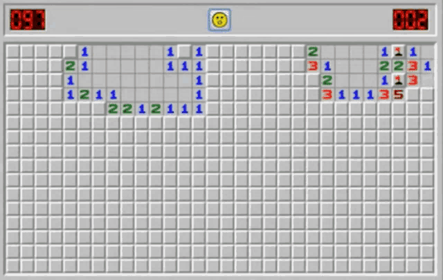

# 👋 Hi, I'm Juan José  
**Aspiring Full Stack Developer | Technology Enthusiast**

  

##  About Me
I embarked on my technology journey a year ago and it's been an incredible adventure! I'm passionate about building scalable applications and learning new technologies. There is nothing more rewarding than seeing clean and scalable code.

### Main skills

### Studying

### Connect with me!

    
     

